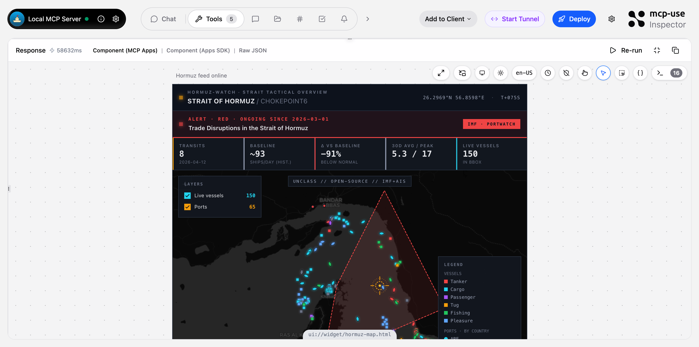
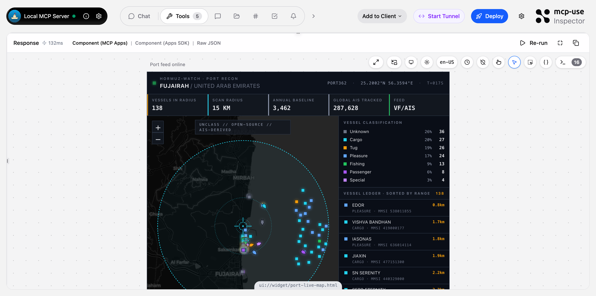
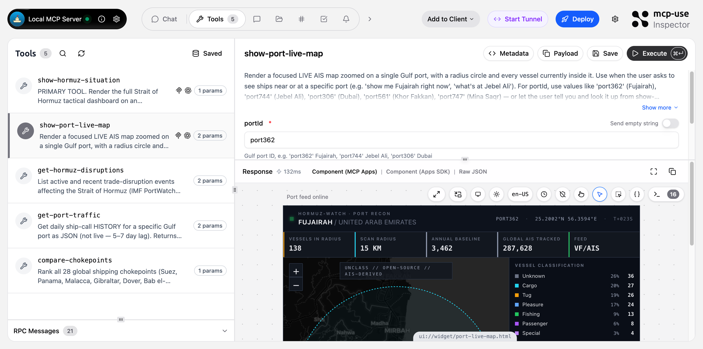

# Hormuz Watch — MCP Server

Tactical maritime situation dashboard for the **Strait of Hormuz**, delivered as an MCP server with two interactive Leaflet map widgets and three JSON tools. Fuses IMF PortWatch chokepoint/port statistics with **live AIS vessel positions** from VesselFinder into a single picture you can ask for in natural language inside Claude, ChatGPT, or any MCP‑Apps-compatible client.

> "Is Hormuz open right now?" · "What ships are at Fujairah?" · "Where does Hormuz rank against Suez and Malacca today?"

## The two widgets

### `show-hormuz-situation` — strait overview

Everything you need to answer *"what's happening in Hormuz?"* in a single pannable map: IMF disruption polygon, 65 Gulf ports color‑coded by country and sized by annual traffic, 150 live AIS vessels inside the strait bbox, a 30‑day transit sparkline, telemetry chips (transits vs. historical baseline, Δ‑below‑normal, live vessel count), and a RED/ORANGE/GREEN alert banner driven by IMF PortWatch.



### `show-port-live-map` — single-port AIS recon

Focused radius scan around any Gulf port. Crosshair marker, scan ring, every vessel inside the radius (heading, type, stale flag), ordered ledger sorted by range, and a composition breakdown by vessel class.



## What the server exposes

All 5 tools visible in the mcp-use Inspector:



| Tool | Kind | Description |
|---|---|---|
| `show-hormuz-situation` | widget | Primary dashboard — full strait overview with live AIS, ports, disruptions, trend. |
| `show-port-live-map` | widget | Radius-scan AIS map around one port (e.g. `port362` Fujairah, `port744` Jebel Ali, `port306` Dubai). |
| `get-hormuz-disruptions` | JSON | Active/recent IMF trade‑disruption events affecting Hormuz with alert level, dates, description. |
| `get-port-traffic` | JSON | Daily ship‑call history for one Gulf port with per‑vessel‑type breakdown. |
| `compare-chokepoints` | JSON | Latest daily transits across all 28 global chokepoints, rankable by total or by vessel type. |

## How it works

### Data sources

**IMF PortWatch** — live ArcGIS FeatureServer layers. No API key, no rate limits in normal use, ~3–7 day reporting lag, cached 1h in process.

| Layer | Used for |
|---|---|
| `Daily_Chokepoints_Data` | Daily transit counts for 28 global chokepoints (Hormuz = `chokepoint6`). |
| `PortWatch_chokepoints_database` | Historical baseline (annual totals by vessel type). |
| `portwatch_disruptions_database` | Active/historical trade‑disruption events with alert level + polygon geometry. |
| `PortWatch_ports_database` | 65 Gulf port metadata. |
| `Daily_Ports_Data` | Per‑port daily ship‑call counts. |

**VesselFinder `/api/pub/mp2`** — live AIS vessel positions (MMSI, name, lat/lon, heading, type). Undocumented binary endpoint used by VesselFinder's own front‑end, reverse‑engineered in `lib/vesselfinder-client.ts`. 30‑second cache. **ToS‑gray**: may be rate‑limited, IP‑blocked, or break without notice. For production deployment, swap to a commercial AIS API (Datalastic, Spire, VesselFinder paid tier). The rest of the dashboard keeps working if AIS fails — `fetchLiveShips` has a `catch` fallback that returns an empty vessel list.

> AISStream.io was tried first and confirmed unusable for the Gulf — terrestrial AIS receivers don't cover the region, so it delivers zero messages from Hormuz. PortWatch + VesselFinder was the only free combination that actually works here.

### Payload shaping

The strait widget needs a lot of data, and the MCP `tools/call` response ships it all as `structuredContent`. To keep that responsive the server trims before returning: disruption polygons are decimated to ≤50 points, live ships are capped at 150 nearest to the chokepoint, history is reduced to `{date, total}`, and unused fields on `latest`, `chokepoint`, and `disruption` are dropped. See `decimatePolygon` / `nearestShips` in `index.ts`.

### Architecture

```
index.ts                       # MCP server + 5 tools (2 widget + 3 JSON)
lib/
├── portwatch-client.ts        # ArcGIS fetchers for 5 PortWatch layers + 1h cache
└── vesselfinder-client.ts     # Binary AIS decoder for /api/pub/mp2 + 30s cache
resources/
├── hormuz-map/                # Strait overview widget
│   ├── widget.tsx             # SSR‑safe entrypoint (McpUseProvider + lazy-loaded map)
│   ├── map-inner.tsx          # Leaflet map + alert banner + telemetry + sparkline
│   └── types.ts               # Zod schemas for widget props
├── port-live-map/             # Single‑port AIS widget
│   ├── widget.tsx
│   ├── map-inner.tsx
│   └── types.ts
├── shared/theme.ts            # Dark tactical theme + ship/country/alert color tables
└── styles.css                 # Tailwind-generated widget styles
```

**Rendering:** OpenStreetMap/CARTO tiles via Leaflet + react-leaflet. Fully interactive — pan, zoom, click popups, tooltips, layer toggles. No map API key. No billing.

**Widget contract:** each tool declares `widget: { name: "hormuz-map" | "port-live-map", invoking, invoked }` at registration. mcp-use auto-wires `openai/outputTemplate` → `ui://widget/<name>.html` and registers the matching resource under `resources/<name>/widget.tsx`. The tool returns `widget({ props, output })`; the props land in `useWidget().props` inside the iframe.

## Built with mcp-use

This project is a pure [mcp-use](https://mcp-use.com) server. What that gets you:

- **`server.tool(...)`** — single-call registration with Zod schema, async callback, and a `widget` config block that links to a React widget folder under `resources/`.
- **`widget({ props, output })` helper** — returns a `CallToolResult` with `structuredContent` populated and automatically picked up by the widget iframe via `useWidget()`.
- **`mcp-use dev`** — starts the MCP server *and* a Vite dev server for the widgets, with HMR, type generation (`.mcp-use/tool-registry.d.ts`), and an Inspector at `/inspector`.
- **`mcp-use build` + `mcp-use deploy`** — one‑shot production build + deploy to mcp-use Cloud.
- **MCP Apps + OpenAI Apps SDK dual protocol** — the same widget renders in Claude (MCP Apps), ChatGPT (Apps SDK), and the Inspector with no per‑client code.

Nothing in this repo calls the raw MCP SDK — it's all `import { MCPServer, widget, object, text, error } from "mcp-use/server"` and `import { useWidget, McpUseProvider } from "mcp-use/react"`.

## Install & run

```bash
npm install
npm run dev
```

Open [http://localhost:3000/inspector](http://localhost:3000/inspector), pick `show-hormuz-situation`, click **Execute**. The interactive map renders with the live RED disruption polygon, all 65 Gulf ports, and every AIS contact inside the strait bbox.

### Connect to Claude / ChatGPT

Start a tunnel from the Inspector (**Start Tunnel** button) or deploy, then add the MCP URL to your client:

- **Claude Desktop** — Settings → Developer → Edit Config → add the server under `mcpServers`.
- **ChatGPT Apps** — add the HTTPS endpoint as a custom connector.
- **Inspector** — already connected, just hit **Add to Client**.

### Deploy

```bash
npm run deploy
```

Pushes a production build (Vite bundle of both widgets + server) to mcp-use Cloud and returns a public HTTPS URL.

## Layout conventions

- `resources/<widget-name>/widget.tsx` must `export default` a React component; the directory name is what the tool's `widget.name` config points at.
- `widgetMetadata.exposeAsTool: false` on both widgets — the tool is declared explicitly in `index.ts`, not auto‑generated from the widget.
- Zod schemas in each widget's `types.ts` are the single source of truth for widget props; the server-side `widget({ props: … })` object must match.

## License

MIT
